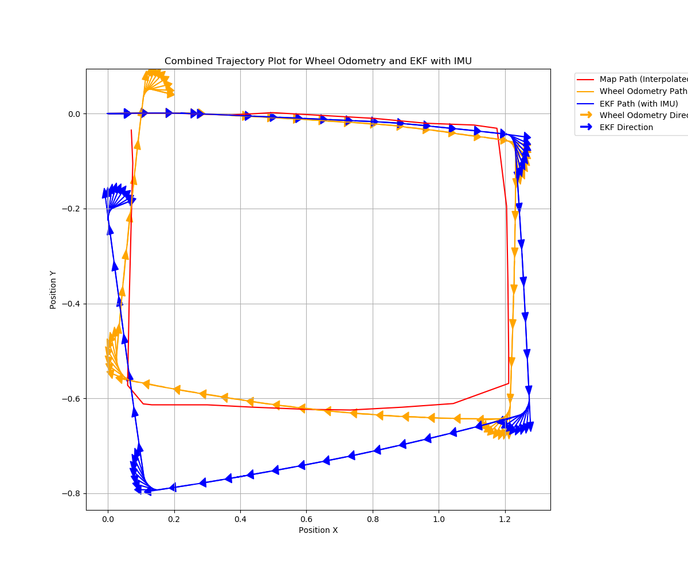
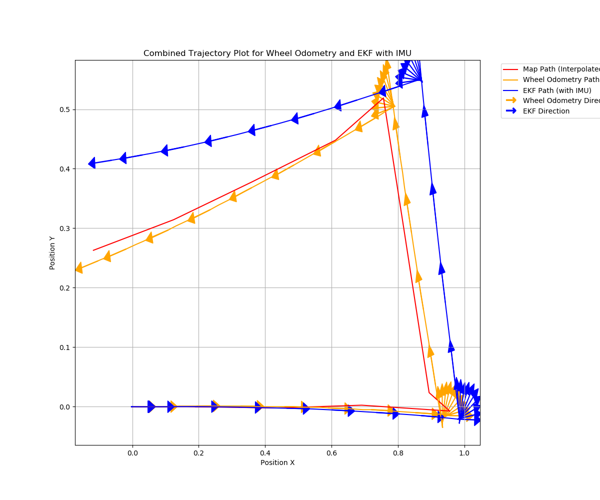

### Integrated Robot Control Ros2 Package
<hr>

* Version : v0.0.3
* Date : 2024-10-09

#### Goal
* robot_localization was applied version

1. Control the keyboard with teleop_twist_keyboard
2. Use odometry data from DC motors with encoders.  
3. IMU can be correct the accumulatable errors in the odometry of DC motor, which uses Extended Kalman Filter.  
4. CSV data can be created.  
5. ekf.yaml will be used to configurate each setting values for robot_localization pkg.  
6. CMP10A imu Ros2 Package was inserted for this project.  
7. imu.launch.py was updated to start cmp10a_imu package.   
8. ekf_robot_control pkg was not applicale fot that reason why the uncertainty was too high to be used to this project.  
7. robot_localization was applied thid project but not that impressive.   

<hr>

* Version : v1.0.0
* Date : 2024-10-29

#### Goal
* robot_localization was applied version

1. imu_recorder_node.py was inserted and verify that imu provides stable data.
2. ekf.yaml was edit to accurate sensor fusion
3. imu was calibrated with WitMotion tool. especially magnet section, angluar section

```
ekf_filter_node:
    ros__parameters:

        frequency: 50.0
        two_d_mode: true
        publish_tf: true
        map_frame: map              # Defaults to "map" if unspecified
        odom_frame: odom            # Defaults to "odom" if unspecified
        base_link_frame: base_link  # Defaults to "base_link" if unspecified
        world_frame: odom           # Defaults to the value of odom_frame if unspecified


        odom0: /odom
                #########################
                # x      y      z       #
                # roll  pitch   yaw     #
                # vx    vy      vz      #
                # vroll vpitch  vyaw    #
                # ax    ay      az      #
                #########################
        odom0_config: [false, false, false,
                       false, false, false,
                       true, true, false,
                       false, false, true,
                       false, false, false]

        odom0_differential: false

        imu0: /imu/data_raw
        imu0_config: [false, false, false,
                      false, false,  true,
                      false, false, false,
                      false, false,  true,
                      true, false, false]

        imu0_differential: false


        # AMCL Pose topic
        pose0: /amcl_pose  # Pose
        pose0_config: [true, true, false,
                        false, false, true,
                        false, false, false,
                        false, false, false,
                        false, false, false]
        pose0_differential: false


# ordered as x, y, z, roll, pitch, yaw, vx, vy, vz, vroll, vpitch, vyaw, ax, ay, az. Defaults to the matrix below if
        process_noise_covariance: [0.02,   0.0,    0.0,    0.0,    0.0,    0.0,    0.0,     0.0,     0.0,    0.0,    0.0,    0.0,    0.0,    0.0,    0.0,
                                   0.0,    0.02,   0.0,    0.0,    0.0,    0.0,    0.0,     0.0,     0.0,    0.0,    0.0,    0.0,    0.0,    0.0,    0.0,
                                   0.0,    0.0,    0.06,   0.0,    0.0,    0.0,    0.0,     0.0,     0.0,    0.0,    0.0,    0.0,    0.0,    0.0,    0.0,
                                   0.0,    0.0,    0.0,    0.03,   0.0,    0.0,    0.0,     0.0,     0.0,    0.0,    0.0,    0.0,    0.0,    0.0,    0.0,
                                   0.0,    0.0,    0.0,    0.0,    0.03,   0.0,    0.0,     0.0,     0.0,    0.0,    0.0,    0.0,    0.0,    0.0,    0.0,
                                   0.0,    0.0,    0.0,    0.0,    0.0,    0.06,   0.0,     0.0,     0.0,    0.0,    0.0,    0.0,    0.0,    0.0,    0.0,
                                   0.0,    0.0,    0.0,    0.0,    0.0,    0.0,    0.025,   0.0,     0.0,    0.0,    0.0,    0.0,    0.0,    0.0,    0.0,
                                   0.0,    0.0,    0.0,    0.0,    0.0,    0.0,    0.0,     0.025,   0.0,    0.0,    0.0,    0.0,    0.0,    0.0,    0.0,
                                   0.0,    0.0,    0.0,    0.0,    0.0,    0.0,    0.0,     0.0,     0.04,   0.0,    0.0,    0.0,    0.0,    0.0,    0.0,
                                   0.0,    0.0,    0.0,    0.0,    0.0,    0.0,    0.0,     0.0,     0.0,    0.01,   0.0,    0.0,    0.0,    0.0,    0.0,
                                   0.0,    0.0,    0.0,    0.0,    0.0,    0.0,    0.0,     0.0,     0.0,    0.0,    0.01,   0.0,    0.0,    0.0,    0.0,
                                   0.0,    0.0,    0.0,    0.0,    0.0,    0.0,    0.0,     0.0,     0.0,    0.0,    0.0,    0.02,   0.0,    0.0,    0.0,
                                   0.0,    0.0,    0.0,    0.0,    0.0,    0.0,    0.0,     0.0,     0.0,    0.0,    0.0,    0.0,    0.03,   0.0,    0.0,
                                   0.0,    0.0,    0.0,    0.0,    0.0,    0.0,    0.0,     0.0,     0.0,    0.0,    0.0,    0.0,    0.0,    0.01,   0.0,
                                   0.0,    0.0,    0.0,    0.0,    0.0,    0.0,    0.0,     0.0,     0.0,    0.0,    0.0,    0.0,    0.0,    0.0,    0.01]

        initial_estimate_covariance: [1e-9, 0.0,    0.0,    0.0,    0.0,    0.0,    0.0,    0.0,    0.0,    0.0,     0.0,     0.0,     0.0,    0.0,    0.0,
                                      0.0,    1e-9, 0.0,    0.0,    0.0,    0.0,    0.0,    0.0,    0.0,    0.0,     0.0,     0.0,     0.0,    0.0,    0.0,
                                      0.0,    0.0,    1e-9, 0.0,    0.0,    0.0,    0.0,    0.0,    0.0,    0.0,     0.0,     0.0,     0.0,    0.0,    0.0,
                                      0.0,    0.0,    0.0,    1e-9, 0.0,    0.0,    0.0,    0.0,    0.0,    0.0,     0.0,     0.0,     0.0,    0.0,    0.0,
                                      0.0,    0.0,    0.0,    0.0,    1e-9, 0.0,    0.0,    0.0,    0.0,    0.0,     0.0,     0.0,     0.0,    0.0,    0.0,
                                      0.0,    0.0,    0.0,    0.0,    0.0,    1e-9, 0.0,    0.0,    0.0,    0.0,     0.0,     0.0,     0.0,    0.0,    0.0,
                                      0.0,    0.0,    0.0,    0.0,    0.0,    0.0,    1e-9, 0.0,    0.0,    0.0,     0.0,     0.0,     0.0,    0.0,    0.0,
                                      0.0,    0.0,    0.0,    0.0,    0.0,    0.0,    0.0,    1e-9, 0.0,    0.0,     0.0,     0.0,     0.0,    0.0,    0.0,
                                      0.0,    0.0,    0.0,    0.0,    0.0,    0.0,    0.0,    0.0,    1e-9, 0.0,     0.0,     0.0,     0.0,    0.0,    0.0,
                                      0.0,    0.0,    0.0,    0.0,    0.0,    0.0,    0.0,    0.0,    0.0,    1e-9,  0.0,     0.0,     0.0,    0.0,    0.0,
                                      0.0,    0.0,    0.0,    0.0,    0.0,    0.0,    0.0,    0.0,    0.0,    0.0,     1e-9,  0.0,     0.0,    0.0,    0.0,
                                      0.0,    0.0,    0.0,    0.0,    0.0,    0.0,    0.0,    0.0,    0.0,    0.0,     0.0,     1e-9,  0.0,    0.0,    0.0,
                                      0.0,    0.0,    0.0,    0.0,    0.0,    0.0,    0.0,    0.0,    0.0,    0.0,     0.0,     0.0,     1e-9, 0.0,    0.0,
                                      0.0,    0.0,    0.0,    0.0,    0.0,    0.0,    0.0,    0.0,    0.0,    0.0,     0.0,     0.0,     0.0,    1e-9, 0.0,
                                      0.0,    0.0,    0.0,    0.0,    0.0,    0.0,    0.0,    0.0,    0.0,    0.0,     0.0,     0.0,     0.0,    0.0,    1e-9]

```


<hr>

* Version : v1.0.1
* Date : 2024-10-30

#### Goal
* sensor_sync_node was applied version

1. The previously implemented sensor_sync_node did not actually publish synchronized topics, but this time, it does publish /sync/odom, /sync/imu, and /sync/scan.  
2. The usbSerial used to collect odom data applies CRC to verify data integrity, but data corruption issues remain noticeable. The cumulative success rate is approximately around 70%, so further improvements are needed to address this issue.  




<hr>

* Version : v.1.1
* Date : 2024-11-06

#### Goal
* Usb serial data communication for RaspberryPi-Pico was upgraded

1. CRC was used to check message was fully transfered.  
2. ctx, etx was added to the message to check the start point of it.  
3. Message transfer rate was almost up to 100%.  